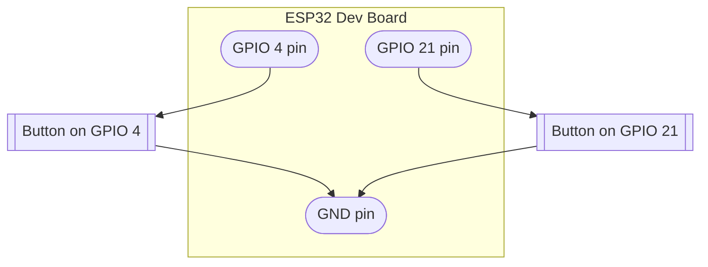

# ESPNOW Hardware Connection Guide

## ESP32 Dev Board (Receiver)

### Required Components
- ESP32 dev board
- Micro USB cable
- (Optional) LED if you want to verify LED functionality separately

### Pin Configuration
- Built-in LED: **GPIO 2** on most ESP32 dev boards
- USB for programming: Standard Micro USB port

### Connection Setup
1. Connect Micro USB cable to the receiver ESP32
2. Connect the other end to your computer
3. The board will power up (you may see a tiny LED indicator)

### Verification
- Check Device Manager (Windows) for a COM port
- You should see "USB to UART Bridge" or similar

---

## ESP32 Dev Board (Transmitter)

### Required Components
- ESP32 Dev Board (typically 30-pin or 36-pin)
- Button (momentary switch)
- 10kΩ resistor (pull-up)
- Jumper wires
- Micro USB cable

### Pin Configuration
- Button Inputs: **GPIO 4** and **GPIO 21**
  - GPIO 4 sends a normal strip wave
  - GPIO 21 sends a wave from the opposite end
- USB for programming: Standard Micro USB port
- Buttons use internal pull-up (no external resistor needed)

### Button Wiring Diagram



### Connection Setup
1. Connect a button between GPIO 4 and the board GND pin
2. Connect a second button between GPIO 21 and the board GND pin
3. The code enables internal pull-up resistors for both button pins
4. Connect Micro USB cable for programming

### Verification
- Check Device Manager for a COM port
- You should see entries like "USB-SERIAL CH340" or "Silicon Labs CP210x"

---

## Finding COM Ports in Windows

### Method 1: Device Manager
1. Right-click **Start** → **Device Manager**
2. Look for **Ports (COM & LPT)**
3. Expand the section
4. You should see entries like "USB-SERIAL CH340" or "Silicon Labs CP210x"
5. Note the COM port number (e.g., COM3, COM4)

### Method 2: PowerShell
```powershell
Get-CimInstance Win32_PnPEntity | Where-Object {$_.Name -match 'COM\d+'} | Select-Object Name
```

### Method 3: Using the Wrapper Script
```powershell
.\flash_receiver.ps1 -Port COM3
```

---

## Troubleshooting

### Port Not Found
- Try different USB ports on your computer
- Try a different USB cable
- Check if drivers are installed (usually automatic on Windows 10/11)
- Restart your computer

### Board Not Responding
- Press the EN (Enable) button on the board
- Make sure the correct board is selected in PlatformIO using `platformio.ini`

### Button Not Working
- Check the wiring (should be GPIO 4 and GND)
- Verify the button is making contact
- Test with a continuity meter

### LED Not Lighting
- Verify GPIO 2 is correct for your ESP32 receiver board
- Check polarity if using external LED
- Built-in LED may be active-low (inverted logic)
